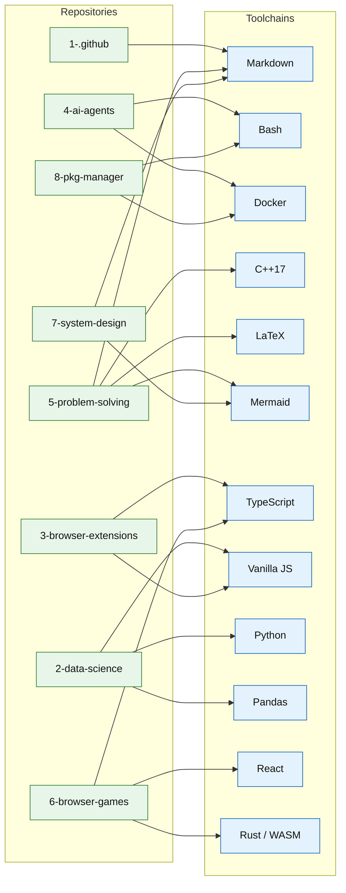

# Ecosystem — repo → tech map

**Parent:** [`README.md`](./README.md)

How the repositories relate to the toolchains they run on. Every language is the best tool for its job — one toolchain per purpose, deliberately chosen.

## Repo → tools

| Repo | Tools | Why |
|---|---|---|
| 1-.github | Markdown | Organization entry point — profile README + shared GitHub config. |
| 2-data-science | Python · Pandas · Vanilla JS | Collect and analyze stock market, lottery, and news data; render static dashboards. |
| 3-browser-extensions | TypeScript · Vanilla JS · Vite | Typed JS for the browser runtime, ships without a server. |
| 4-ai-agents | Bash · YAML · Markdown | AI agents — reusable dispatch stages and status tooling. |
| 5-problem-solving | Markdown · C++17 · LaTeX · Mermaid | Competitive-programming reference + behavioral prep. |
| 6-browser-games | Rust/WASM · React · TypeScript | One Rust codebase from engine (WASM) to backend; React where a SPA earns it. |
| 7-system-design | Markdown · Mermaid | Architecture examples, patterns, AWS drills, and 60-minute runbooks. |
| 8-pkg-manager | Bash · Docker · YAML · Markdown | The shell is the interface; one pinned Docker image per language toolchain. |
